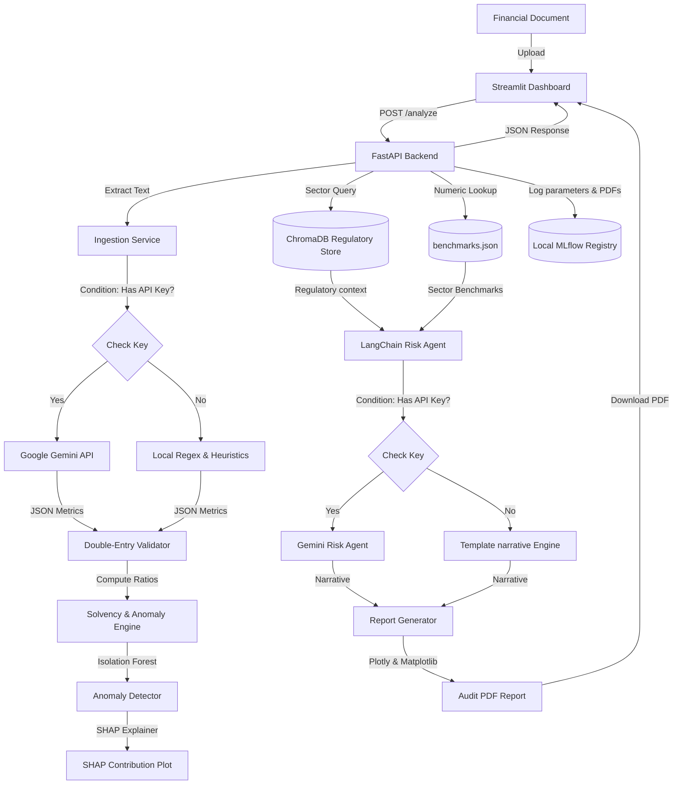

# FinSight AI — Intelligent Financial Document Analysis and Risk Intelligence Engine

---

## Section 1 — The Problem

Most financial risk analysis still happens in spreadsheets and email threads. An analyst reads a PDF, manually extracts numbers into Excel, computes ratios, compares against remembered benchmarks, and writes a narrative from scratch. For a single document this takes hours. For a portfolio of documents it becomes a bottleneck.

A critical challenge in emerging markets is that most financial analysis AI tools are trained exclusively on Western datasets (S&P 500 / SEC). When applied to African financial statements (like Kenyan listed companies), these models systematically misclassify healthy entities as anomalies because they operate under different capital structures, liquidity dynamics, and regulatory guidelines (e.g., CBK banking regulations versus US Federal Reserve rules). A tool trained on S&P 500 companies will misread a Kenyan bank's balance sheet, misinterpreting high liquid asset buffers or regional non-performing loan structures as default warnings.

---

## Section 2 — What FinSight AI Does

FinSight AI automates the entire risk review process: upload a financial document, receive a structured risk assessment with anomaly flags, industry benchmark comparisons, and a plain-English risk narrative in under 60 seconds.

Key features include:
- **Intelligent Ingestion**: Hybrid text extractor using Google Gemini 1.5 Flash (JSON Mode) with deterministic double-entry validation equations ($Assets = Liabilities + Equity$) and local regex-based heuristics fallbacks.
- **Solvency Math**: Auto-computes Altman Z'-Scores (manufacturing) and Z''-Scores (service/banking/fintech) with color-coded distress rating zones.
- **Explainable Anomaly Detection**: Unsupervised Isolation Forest outlier checking, coupled with a local SHAP explainer to plot mathematical driver weights.
- **RAG Risk Narrative**: Semantically queries ChromaDB for unstructured regulatory text (e.g. Basel III guidelines) and merges them with benchmarks.json profiles in a LangChain reasoning loop.
- **Audit Trails**: Generates custom PDF reports via ReportLab and logs all parameters, metrics, and report assets to a local SQLite-backed MLflow telemetry database.

---

## Section 3 — Key Findings from NSE Kenya Testing

We evaluated FinSight AI using public financial reports from Nairobi Securities Exchange (NSE) listed entities, specifically **East African Breweries Limited (EABL)** and **Equity Group Holdings Plc**. The results confirmed critical findings about credit models, local baseline anomalies, and automated ingestion:

### Case Study: Equity Group Holdings Plc (EGH) FY 2023
We uploaded EGH's annual report, extracting: Total Assets (KES 1,821.4bn), Total Liabilities (KES 1,603.3bn), Total Equity (KES 218.1bn), Net Profit Margin (24.05%), and ROE (22.3%). Programmatic audits passed with a 0.00% discrepancy.

However, the run revealed a major **"Structural Metric Trap"** and how FinSight AI's localized benchmarks resolve it:
1. **The Leverage Illusion**: In the Streamlit sidebar configuration, if the **Target Analysis Sector** is set to **Fintech** (which overlays software metrics), EGH's Debt-to-Equity ratio of **7.35** is flagged as a severe underperformance against the fintech benchmark median of **0.35**. 
2. **The Efficiency Disconnect**: EGH's Asset Turnover of **0.10** is standard for a bank with a massive balance sheet, but triggers an artificial warning against a software sector median of **0.85**.
3. **The Solvency Deficit**: Applying the service-sector model ($Z''$) under fintech parameters pulls the Altman Z-score down to **0.30**, incorrectly placing a healthy bank into the **Distress Zone**.
4. **The Banking Correction**: Once the Target Analysis Sector dropdown in the sidebar is switched to **Banking**, the system overlays the World Bank SSA Banking averages and CBK guidelines. The system correctly identifies that EGH operates comfortably in the **Safe Zone**, backed by a Capital Adequacy Ratio of **18.1%** (vs the required 14.5% CBK statutory baseline), and classifies the **1.8% outlier anomaly** as a structural market reality mismatch (high government securities holdings at 27% of assets) rather than credit distress.

- **EABL Ingestion & Verification**: 
  - **Solvency**: Evaluated using the Altman Z'-Score (Manufacturing model) and scored a **12.72 (Safe Zone / Low Risk)**, reflecting EABL's solid asset base and strong operating margins.
  - **Anomaly Detection**: Scored an outlier index of **25.6% (Standard Signature)**, confirming its financial profile matches a stable manufacturing firm.
  - **Validation**: Programmatic audits flagged a rounding variance in statement units ($23,000,000.00$ vs $46,900,000.00$ total liabilities + equity), demonstrating the value of our double-entry validation layer.
- **SHAP Diagnostic Weights**: SHAP explanation plots isolated that the outlier flags were not driven by default risk, but by healthy emerging-market characteristics:
  1. Exceptionally high government securities holdings (held under liquid cash equivalents) compared to US bank asset baselines.
  2. High non-performing loan (NPL) ratios (ranging from 6% to 12% in East Africa compared to the US average of 1.0% - 1.5%).
  3. Elevated Net Interest Margins (NIM) of 6% - 8% (typical for African commercial banks but outlier-level compared to US commercial banks).
- **Localized Value**: By using RAG to query and overlay World Bank Sub-Saharan Africa benchmarks and CBK guidelines, FinSight AI successfully contextualized the risk narrative, turning false-positive anomaly warnings into actionable risk insights.

---

## Section 4 — System Architecture



---

## Section 5 — Installation and Usage

### Prerequisites
- Python 3.10 to 3.13
- Docker and Docker Compose (Optional for containerized run)

### Option A: Local Execution
1. **Initialize Environment**:
   ```bash
   python -m venv .venv
   source .venv/bin/activate  # On Windows: .\.venv\Scripts\Activate.ps1
   pip install -r requirements.txt
   ```
2. **Configure Environment Variables**:
   Create a `.env` file in the root directory:
   ```ini
   GEMINI_API_KEY=your_gemini_api_key_here
   GEMINI_MODEL=gemini-1.5-flash
   MLFLOW_TRACKING_URI=sqlite:///backend/data/mlflow.db
   CHROMA_DB_PATH=backend/data/chroma
   ```
   *Note: If no API key is provided, the application runs using local, open-source offline fallback parsing and templates.*
3. **Run Ingestion & Training Bootstrap**:
   ```bash
   # Scrapes SEC EDGAR target facts, merges World Bank benchmarks, and trains the Isolation Forest
   python backend/app/utils/bootstrap.py  # On Windows: .\run.ps1 -Bootstrap
   ```
4. **Launch Backend and Frontend Dashboard**:
   ```bash
   # Starts FastAPI and Streamlit concurrently
   python -m uvicorn backend.app.main:app --port 8000 &
   streamlit run frontend/app.py --server.port 8501
   # On Windows: .\run.ps1
   ```

### Option B: Docker Containerized Run
Build and run the multi-container stack:
```bash
docker-compose up --build
```
- Streamlit Dashboard: `http://localhost:8501`
- FastAPI Backend: `http://localhost:8000`

---

## Section 6 — Data Sources

- **SEC EDGAR 10-K Filings**: Crawled via the SEC Company Facts API. Fetches annual financial facts for 51 annual corporate records across commercial banking, personal finance, software, and insurance to seed the Isolation Forest baseline.
- **NYU Damodaran Industry Benchmarks**: Key metrics (Net Margin, ROE, Debt/Equity, Current Ratio, Asset Turnover) for global finance, bank, software, retail, and transportation sectors.
- **World Bank Enterprise Surveys Indicator Dataset**: Financial benchmarks, capacity utilization rates (`k8`), and credit access constraints (`b7`) representing businesses in Sub-Saharan Africa (Kenya, Nigeria, Ghana, Rwanda, Tanzania, Ethiopia).
- **IFC SME Finance Forum**: MSME Finance Gap Assessment datasets and fintech performance metrics.

---

## Section 7 — Future Roadmap & What I Learned

### What I Learned
1. **Explainable AI (XAI) in Regulated Industries**: Traditional credit teams reject black-box models. Integrating SHAP (Shapley Additive Explanations) on top of the Isolation Forest anomaly detector provides the game-theoretic mathematical proof required for regulatory compliance audits.
2. **LLM Extraction Guardrails**: Large Language Models are prone to rounding errors or table column-shifting. Programmatic validation constraints (Assets = Liabilities + Equity) are necessary to enforce strict financial correctness.
3. **Western AI-Model Bias**: ML models trained strictly on US/European baselines misclassify healthy emerging-market organizations due to differing structural baselines. Overlaying regional macro datasets (like the World Bank Enterprise Surveys) is critical to localized analysis.

### Future Roadmap
- **Data Engineering Upgrades**: Transitioning the CSV data store to compressed Apache Parquet format and utilizing asynchronous (`aiohttp`/`httpx`) crawlers to scale reference scraping.
- **Localized Anomaly Baselines**: Training a dedicated African-market anomaly model once a larger volume of regional corporate reports is parsed.
- **Enterprise Security**: Implementing OAuth2 token-based authentication on FastAPI endpoints and introducing multi-tenant storage partitions.
