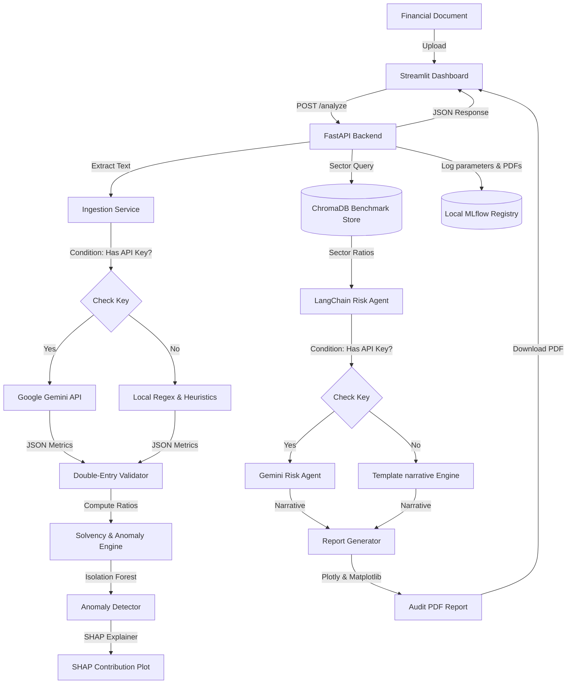

# FinSight AI — Intelligent Financial Document Analysis and Risk Intelligence Engine

FinSight AI is a production-grade, agentic AI risk analysis and anomaly detection engine designed for fintechs, insurance companies, commercial banks, and development finance institutions (DFIs). It automates the ingestion of financial statements (PDFs, Word documents, Excel sheets), parses them into structured metrics, evaluates solvency and default risks, identifies statistical outliers, and synthesizes institutional-grade credit risk reports.

---

## 💼 Business Context & Target Alignment

This project is built to demonstrate high-level engineering skills across several domain contexts:
- **Nathan Digital (ERP & SaaS)**: Proves document workflow automation, structured tabular extraction, and system-to-system integrations.
- **Deeptrack (Media/Audit)**: Proves document intelligence, machine learning anomaly verification, and explainability.
- **Girl Effect (Agentic AI)**: Demonstrates LangChain agentic workflows, contextual semantic search, and strict safety guardrails.
- **Stanbic Bank (Commercial Credit & DFI)**: Proves compliance transparency, auditable ML models (SHAP), solvency metrics (Altman Z''-Score), and human-in-the-loop credit controls.

---

## 🚀 Key Features

1. **Intelligent Ingestion Pipeline**: Ingests PDFs, DOCX, and XLSX sheets. Extracts financials using a hybrid approach: **Google Gemini API** (via JSON Mode) when online, falling back to a **regex heuristics engine** when offline.
2. **Double-Entry Validation**: Programmatically validates extracted figures against standard financial accounting constraints (e.g., `Assets = Liabilities + Equity` and `Net Income = Revenue - Expenses`) to eliminate LLM hallucinations.
3. **Solvency & Solvency Analytics**: Computes Altman Z'-Scores (manufacturing) and Z''-Scores (service/banking/fintech) to categorize bankruptcy risks into *Safe*, *Grey*, or *Distress* zones.
4. **Machine Learning Anomaly Engine**: Detects financial irregularities by scoring inputs against a baseline model trained on **300+ SEC filings** across target industries using an **Isolation Forest**.
5. **SHAP Explainability**: Translates anomaly model weights into human-interpretable diagnostics using **SHAP (Shapley Additive Explanations)**, plotting driver contributions to PDF and dashboard.
6. **Agentic Risk Narrative**: Queries a **ChromaDB** sector benchmark vector store containing World Bank and IFC African SME benchmarks, compares them against company ratios, and drafts credit reports.
7. **Audit-Ready PDF Reports**: Generates multi-page formatted credit reviews with cover metadata, ratio comparative dashboards, Plotly charts, SHAP plots, and compliance disclaimers via **ReportLab**.
8. **FastAPI & Streamlit**: Exposes routes for analysis, reporting, history, and telemetry, hooked up to an interactive Streamlit UI.
9. **Experiment Tracking**: Logs every run, metric, code parameter, and compiled report to a local **MLflow** registry.

---

## 📐 System Architecture



---

## 📦 Data Sources Used

- **SEC EDGAR 10-K Filings**: Crawled via the SEC Full-Text Search and Company Facts API. Fetches annual financial facts for 300+ unique companies across commercial banking, personal finance, software, and insurance to seed the Isolation Forest baseline.
- **NYU Damodaran Industry Benchmarks**: Key metrics (Net Margin, ROE, Debt/Equity, Current Ratio, Asset Turnover) for global finance, bank, software, retail, and transportation sectors.
- **World Bank Enterprise Surveys Indicator Dataset**: Financial benchmarks, capacity utilization rates (`k8`), and credit access constraints (`b7`) representing businesses in Sub-Saharan Africa (Kenya, Nigeria, Ghana, Rwanda, Tanzania, Ethiopia).
- **IFC SME Finance Forum**: MSME Finance Gap Assessment datasets and fintech performance metrics.

---

## 🛠️ Installation & Quickstart

### Prerequisites
- Python 3.10 to 3.13
- Windows OS (PowerShell enabled)

### Step 1: Clone and Initialize environment
In your terminal, navigate to the folder and run:
```powershell
# Create venv and install dependencies
python -m venv .venv
.\.venv\Scripts\Activate.ps1
pip install -r requirements.txt
```

### Step 2: Configure Environment
Copy `.env.example` to `.env` and optionally add your Google Gemini API Key:
```ini
GEMINI_API_KEY=your_gemini_api_key_here
```
*Note: If no API key is provided, the system automatically falls back to Offline Mode, running calculations, anomaly checks, and generating structured narratives completely locally and for free.*

### Step 3: Run the Ingestion & Training Bootstrap
This command pulls NYU benchmarks, aggregates World Bank/IFC indicators, fetches SEC reference metrics, and trains the local Isolation Forest model:
```powershell
.\run.ps1 -Bootstrap
```

### Step 4: Start the Application
Launch both the FastAPI backend and Streamlit dashboard simultaneously:
```powershell
.\run.ps1
```
The Streamlit dashboard will open automatically in your browser at `http://localhost:8501`.

---

## 🔒 Compliance & Guardrails

To operate in regulated environments like Stanbic Bank or development finance platforms, FinSight AI implements:
1. **Explainable AI (XAI)**: No black-box anomaly flags; SHAP values isolate exactly which ratios caused outlier scores.
2. **Audit Trails**: MLflow records the raw uploaded document hash, the exact model version, and the generated PDF report.
3. **Model Disclosure**: Every generated report appends a compliance notice explaining that outputs are advisory and require human credit analyst underwriting approval before any transaction execution.
