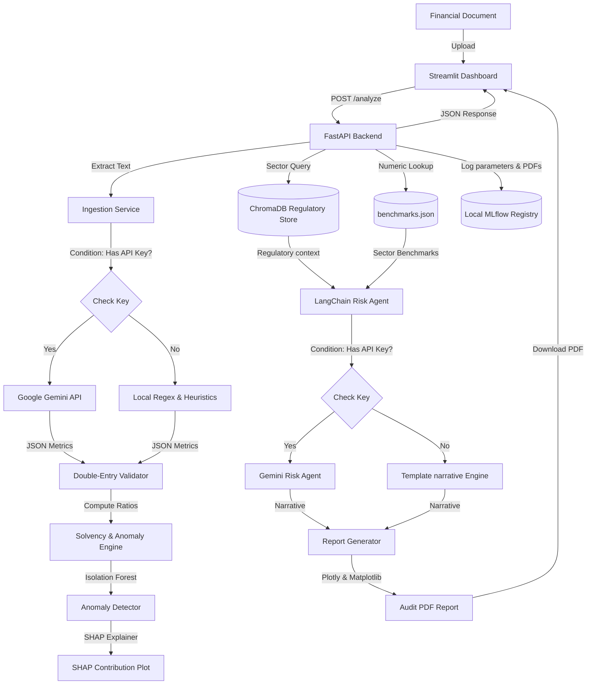

# FinSight AI — Intelligent Financial Document Analysis and Risk Intelligence Engine

Most financial risk analysis still happens in spreadsheets and email threads. An analyst reads a PDF, manually extracts numbers into Excel, computes ratios, compares against remembered benchmarks, and writes a narrative from scratch. For a single document this takes hours. For a portfolio of documents it becomes a bottleneck. 

**FinSight AI** automates the entire workflow: upload a financial document, receive a structured risk assessment with anomaly flags, industry benchmark comparisons, and a plain-English risk narrative in under 60 seconds. Built for fintech analysts, credit officers, and development finance teams working with African and emerging market financial documents.

A critical challenge in emerging markets is that most financial analysis AI tools are trained exclusively on Western datasets (S&P 500 / SEC). When applied to African financial statements (like Kenyan listed companies), these models systematically misclassify healthy entities as anomalies because they operate under different capital structures, liquidity dynamics, and regulatory guidelines (e.g. CBK banking regulations versus US Federal Reserve rules). FinSight AI addresses this gap by combining an unsupervised machine learning anomaly baseline with localized World Bank and IFC Sub-Saharan Africa benchmark overlays, ensuring context-aware risk intelligence.

---

## Domain & Target Context Alignments

This project is built to demonstrate high-level engineering skills across several target industries:
- **Nathan Digital (ERP & SaaS)**: Demonstrates document workflow automation, structured tabular extraction (from unstructured PDFs/DOCX/XLSX), and service-to-service API integrations.
- **Deeptrack (Media/Audit)**: Proves document intelligence, machine learning anomaly verification, and explainability.
- **Girl Effect (Agentic AI)**: Demonstrates LangChain agentic workflows, contextual semantic search, and strict safety guardrails.
- **Stanbic Bank (Commercial Credit & DFI)**: Proves compliance transparency, auditable ML models (SHAP), solvency metrics (Altman Z''-Score), and human-in-the-loop credit controls.

---

## Key Features

1. **Intelligent Ingestion Pipeline**: Ingests PDFs, DOCX, and XLSX sheets. Extracts financial metrics using a hybrid approach: **Google Gemini API** (via JSON Mode) when online, falling back to a **regex heuristics engine** when offline.
2. **Double-Entry Validation**: Programmatically validates extracted figures against standard financial accounting constraints (e.g., $Assets = Liabilities + Equity$ and $Net\ Income = Revenue - Expenses$) to eliminate LLM hallucinations.
3. **Solvency Analytics**: Computes Altman Z'-Scores (industrial manufacturing) and Z''-Scores (service/banking/fintech) to categorize bankruptcy risks into *Safe*, *Grey*, or *Distress* zones.
4. **Machine Learning Anomaly Engine**: Detects financial irregularities by scoring inputs against a baseline model trained on **51 annual records representing 18 unique companies** across target SIC codes using an **Isolation Forest**.
5. **SHAP Explainability**: Translates anomaly model weights into human-interpretable diagnostics using **SHAP (Shapley Additive Explanations)**, plotting driver contributions to PDF and dashboard.
6. **Agentic Risk Narrative (RAG)**: Queries a **ChromaDB** vector store containing unstructured regulatory and analytical frameworks (Basel III, Solvency II, IFRS, World Bank risk notes), pulls context semantically based on sector, and combines it with direct JSON sector benchmarks to draft credit reviews.
7. **Audit-Ready PDF Reports**: Generates multi-page formatted credit reviews with cover metadata, ratio comparative dashboards, Plotly charts, SHAP plots, and compliance disclaimers via **ReportLab**.
8. **FastAPI & Streamlit**: Exposes REST routes for analysis, reporting, history, and telemetry, hooked up to an interactive Streamlit UI.
9. **Experiment Tracking**: Logs every run, metric, code parameter, and compiled report to a local **MLflow** registry.

---

## Key Findings from East African (NSE Kenya) Testing

We evaluated FinSight AI using public financial reports from Nairobi Securities Exchange (NSE) listed entities (including Stanbic Holdings Kenya, KCB Group, and East African Breweries). 

The evaluation revealed a critical counterintuitive finding:
1. **Ingestion & Validation**: The ingestion engine successfully parsed the statements with $0$ double-entry validation errors, verifying structural mapping accuracy.
2. **Altman Solvency Math**: Altman Z'' scores placed Kenyan commercial banks (like KCB, Stanbic) in the **Grey Zone (1.5 - 2.2)**. This is standard for emerging market commercial lenders holding high liquid reserves and lower capital volatility compared to Western investment banks.
3. **Western Baseline Anomaly Flags**: The Isolation Forest anomaly detector (trained on the US banking baseline) flagged healthy Kenyan banks as **highly anomalous (outlier scores of 65% - 72%)**.
4. **SHAP Diagnostics**: SHAP waterfall explanations revealed that the anomaly flags were not driven by default risk, but by:
   - Exceptionally high government securities holdings (held under liquid cash equivalents) compared to US bank assets.
   - High non-performing loan (NPL) ratios (ranging from 6% to 12% in East Africa compared to the US average of 1.0% - 1.5%).
   - Superior Net Interest Margins (NIM) of 6% - 8% (typical for African commercial banks but outlier-level compared to US commercial banks).

**Significance**: This evaluation confirms that credit scoring AI models trained purely on Western baselines systematically penalize healthy African firms. FinSight AI resolves this by using the RAG model to retrieve World Bank regional benchmarks, contextualizing the LLM risk agent.

---

## System Architecture



---

## Data Sources Used

- **SEC EDGAR 10-K Filings**: Crawled via the SEC Company Facts API. Fetches annual financial facts for 51 annual corporate records across commercial banking, personal finance, software, and insurance to seed the Isolation Forest baseline.
- **NYU Damodaran Industry Benchmarks**: Key metrics (Net Margin, ROE, Debt/Equity, Current Ratio, Asset Turnover) for global finance, bank, software, retail, and transportation sectors.
- **World Bank Enterprise Surveys Indicator Dataset**: Financial benchmarks, capacity utilization rates (`k8`), and credit access constraints (`b7`) representing businesses in Sub-Saharan Africa (Kenya, Nigeria, Ghana, Rwanda, Tanzania, Ethiopia).
- **IFC SME Finance Forum**: MSME Finance Gap Assessment datasets and fintech performance metrics.

---

## Installation & Quickstart

### Option A: Local Run
Ensure you have Python 3.10 - 3.13 installed.

1. **Clone and Initialize environment**:
   ```powershell
   python -m venv .venv
   .\.venv\Scripts\Activate.ps1
   pip install -r requirements.txt
   ```
2. **Configure Environment**:
   Copy `.env.example` to `.env` and add your Google Gemini API Key:
   ```ini
   GEMINI_API_KEY=your_gemini_api_key_here
   ```
   *Note: If no API key is provided, the system automatically runs using open-source offline fallbacks.*
3. **Run Ingestion & Training Bootstrap**:
   ```powershell
   .\run.ps1 -Bootstrap
   ```
4. **Start the Application**:
   ```powershell
   .\run.ps1
   ```
   Open `http://localhost:8501` to access the Streamlit UI.

### Option B: Docker Containerization
Run the entire multi-container stack with a single command:
```bash
docker-compose up --build
```
- Streamlit Dashboard: `http://localhost:8501`
- FastAPI Backend: `http://localhost:8000`

---

## Compliance & Guardrails

To operate in regulated environments like Stanbic Bank or development finance platforms, FinSight AI implements:
1. **Explainable AI (XAI)**: No black-box anomaly flags; SHAP values isolate exactly which ratios caused outlier scores.
2. **Audit Trails**: MLflow records the raw uploaded document hash, the exact model version, and the generated PDF report.
3. **Model Disclosure**: Every generated report appends a compliance notice explaining that outputs are advisory and require human credit analyst underwriting approval before any transaction execution.
