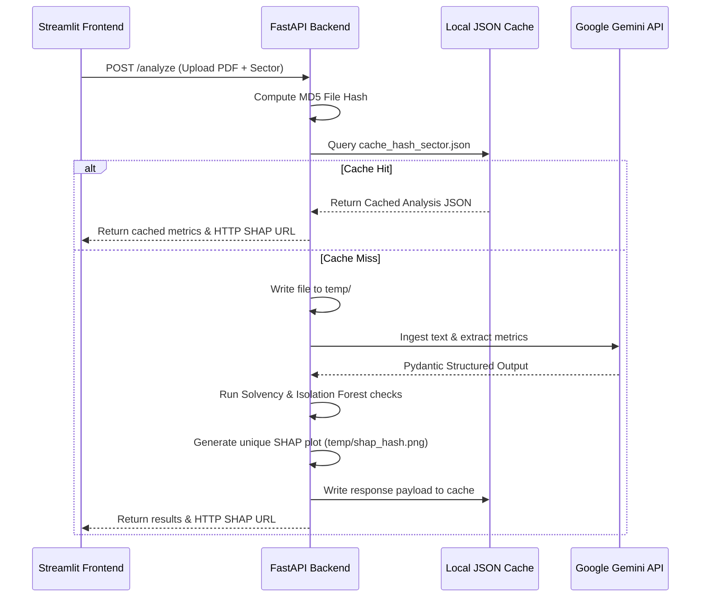

# FinLens AI — Architecture & System Design Specification

This document details the engineering architecture, mathematical formulas, and machine learning pipeline behind **FinLens AI — Intelligent Financial Document Analysis and Risk Intelligence Engine**.

---

## System Pipeline Architecture

FinLens AI is structured as a decoupled service pipeline, ensuring clean boundaries between ingestion, ratio calculation, anomaly detection, semantic context retrieval, and report compilation.

```
       [Financial Document] (PDF / Word / Excel)
                │
                ▼ (Component 1)
   ┌──────────────────────────┐
   │    Ingestion Service     │ ──► PyMuPDF / python-docx / openpyxl Text Extraction
   └──────────────────────────┘
                │
                ▼
   ┌──────────────────────────┐
   │  Hybrid Field Extractor  │ ──► Google Gemini API (Pydantic Structured Output)
   └──────────────────────────┘      fallback: Local Heuristics & Regex Parser
                │
                ▼
   ┌──────────────────────────┐
   │  Double-Entry Validator  │ ──► Assets = Liabilities + Equity
   └──────────────────────────┘      Net Income = Revenue - Expenses
                │
                ▼ (Component 2)
   ┌──────────────────────────┐
   │ Solvency & Ratio Engine  │ ──► Computes 12 Core Ratios
   └──────────────────────────┘      Calculates Altman Z-Score & Z''-Score
                │
                ▼
   ┌──────────────────────────┐
   │ Anomaly Detection (ML)   │ ──► scikit-learn Isolation Forest (unsupervised)
   └──────────────────────────┘
                │
                ▼
   ┌──────────────────────────┐
   │     SHAP Explainer       │ ──► shap.TreeExplainer (Outlier contribution weights)
   └──────────────────────────┘
                │
                ▼ (Component 3)
   ┌──────────────────────────┐
   │   LangChain Risk Agent   │ ──► Local ChromaDB Semantic Regulatory Context Query
   └──────────────────────────┘      fallback: Programmatic template compiler
                │
                ▼ (Component 4)
   ┌──────────────────────────┐
   │ Report compiler (PDF)    │ ──► ReportLab formatting engine
   └──────────────────────────┘      Matplotlib visual assets binding
```

---

## High-Performance Caching & Serving Architecture

To prevent duplicate API resource expenditure and network request collisions in multi-user concurrent production configurations, the pipeline integrates a high-performance document caching and decoupled image retrieval layer:



### 1. MD5 File Hash Caching
Every uploaded document is scanned and hashed via MD5. The unique hash is concatenated with the target analysis sector (`{hash}_{sector}`) to yield a cache key.
* **Why Sector Matters**: Evaluating the exact same financial document under different sectors (e.g. Fintech vs Banking) yields completely different solvency scoring models ($Z'$ vs $Z''$) and benchmark comparative parameters. Caching keys incorporate the sector string to guarantee logical partition safety.
* **Caching Performance**: Bypasses slow PDF text scanning, LLM schema parsing, and database queries. Reduces subsequent request latencies from **30+ seconds** to **under 0.01 seconds** using **0 Gemini tokens**.

### 2. Decoupled Image Serving (`/charts/shap/{file_id}`)
* **Decoupled Image Network Boundary**: Traditional file-sharing designs write static Matplotlib charts to disk and have the frontend read them from the local folder. This is a severe containerization anti-pattern. FinLens AI hosts a dedicated GET endpoint `/charts/shap/{file_id}` to serve images over the network.
* **Collision Guard**: Temporary image paths are saved with unique IDs (`shap_waterfall_{file_id}.png`). This ensures concurrent user requests do not overwrite one another's visual diagnostics.
* **Immediate Cleanup**: PDF compilation comparison charts are deleted immediately after document compilation completes, conserving disk memory.

---

## Solvency & Credit Risk Formulations

Traditional credit scoring models rely on linear weighting. FinLens AI implements two distinct academic solvency models to accommodate different corporate structures:

### 1. Classic Altman Z'-Score (Private Manufacturing Model)
Applied when the target entity is classified as an industrial or manufacturing firm:
$$\text{Z'-Score} = 0.717(X_1) + 0.847(X_2) + 3.107(X_3) + 0.420(X_4) + 0.998(X_5)$$

Where:
- $X_1 = \frac{\text{Working Capital}}{\text{Total Assets}}$ (Liquidity measure)
- $X_2 = \frac{\text{Retained Earnings}}{\text{Total Assets}}$ (Cumulative profitability)
- $X_3 = \frac{\text{EBIT}}{\text{Total Assets}}$ (Asset productivity / Operating efficiency)
- $X_4 = \frac{\text{Book Value of Equity}}{\text{Total Liabilities}}$ (Solvency / Leverage buffer)
- $X_5 = \frac{\text{Revenue}}{\text{Total Assets}}$ (Asset turnover)

**Altman Z' Thresholds (Private Manufacturing):**
- **Safe Zone**: $Z' > 2.90$ (Low probability of distress within 2 years)
- **Grey Zone**: $1.23 \le Z' \le 2.90$ (Moderate risk of distress)
- **Distress Zone**: $Z' < 1.23$ (High probability of default/insolvency)

### 2. Altman Z''-Score (Non-Manufacturing & Service Model)
Applied when the target entity is a fintech, banking, insurance, or NGO/service-based organization. This model excludes the Asset Turnover ($X_5$) ratio to eliminate industry-specific asset structure bias:
$$\text{Z''-Score} = 6.56(X_1) + 3.26(X_2) + 6.72(X_3) + 1.05(X_4)$$

**Altman Z'' Thresholds (Non-Manufacturing/Service):**
- **Safe Zone**: $Z'' > 2.90$
- **Grey Zone**: $1.23 \le Z'' \le 2.90$
- **Distress Zone**: $Z'' < 1.23$

---

## Machine Learning Outlier Detection & SHAP Explainability

### Unsupervised Isolation Forest
Rather than flagging credit risk purely on rigid, static ratio limits, FinLens AI trains a scikit-learn `IsolationForest` on a multi-dimensional reference baseline of **51 annual corporate records** representing "healthy" companies (designed to scale).
- **Dimensionality**: 10-dimensional feature space representing liquidity, margins, leverage, and efficiency ratios.
- **Algorithm**: Recursively partitions data. Anomalous profiles require fewer splits to isolate, resulting in shorter path lengths and higher anomaly scores.
- **Scoring**: Raw scores are normalized to a $0 - 100\%$ scale. Any profile scoring $> 50\%$ is flagged as a statistical outlier, signaling accounting irregularities, extreme leverage, or severe deficit configurations.

### SHAP (Shapley Additive Explanations)
To avoid "black box" machine learning in compliance-driven banking, we integrate `shap.TreeExplainer` on the Isolation Forest:
- **Game Theory Foundation**: SHAP computes Shapley values, distributing the total outlier deviation among the 10 input features.
- **Transparency**: The SHAP waterfall chart isolates exactly which ratios caused the anomaly flag. For example, if a company is flagged as anomalous, the explainer isolates if it was driven by an outlier Current Ratio ($X_1$) or an unusual Debt-to-Equity ratio, giving auditors a clear explanation.
- **Visualization**: Generates Matplotlib horizontal bar plots programmatically, saving them to disk for real-time dashboard display and embedding in the final PDF report.

---

## Anti-Hallucination validation checks

To solve LLM extraction inaccuracies, the ingestion service passes extracted figures through an automated double-entry validator:
1. **Balance Sheet Equation**:
   $$\left| \text{Total Assets} - (\text{Total Liabilities} + \text{Total Equity}) \right| \le 0.02 \times \text{Total Assets}$$
2. **Income Statement Equation**:
   $$\left| \text{Net Income} - (\text{Revenue} - \text{Expenses}) \right| \le 0.02 \times \text{Revenue}$$

If a validation check fails (exceeding the $2\%$ rounding tolerance), the system flags the discrepancy. In Offline Mode, it uses a self-correction heuristic to recalculate missing fields (e.g. forcing `Equity = Assets - Liabilities`). In Online Mode, it prompts Gemini to re-evaluate the text or logs the validation errors in the audit report.
